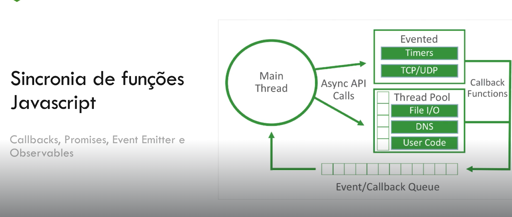
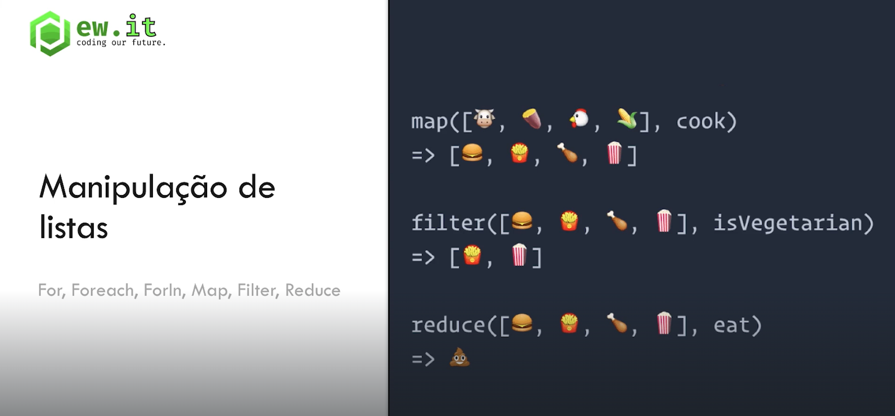
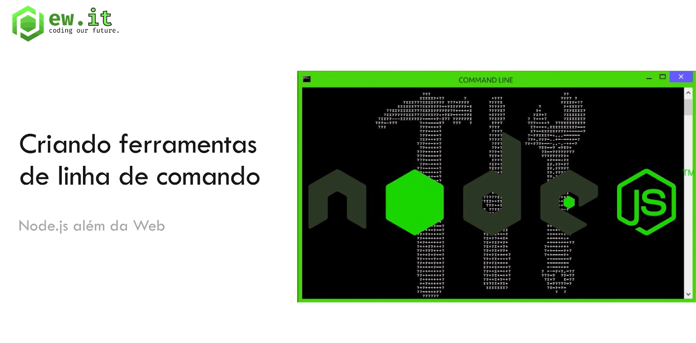
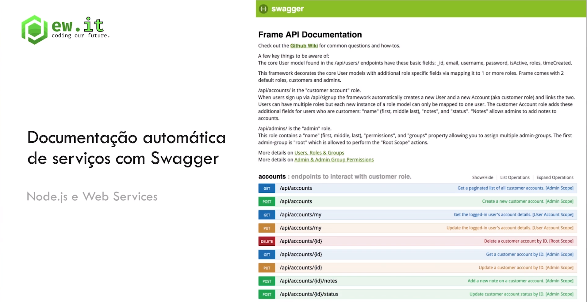

# Criando APIS com nodeJS

### Curso: IMERSÃO EM DESENVOLVIMENTO DE APIS COM NODE.JS (Erick Wendel)

### O que será visto durante o curso

### Sincronia de funções

### Manipulação de listas

### Criação de CLI

### Multiplos bancos de dados

### Criação de apis com Hapi.js

### Documentação automatica com Swagger

### Autenticação com JWT

### Publicação de serviços

### O que é Node.js

- Plataforma para construção de aplicações BackEnd usando `Javascript`;
- Ferramente inicialmente criada para resolver o problema de upload de imagens em 2009 (Ryan Dahl);
- Usado também para construção de ferramentas de linha de comando.

NOde j